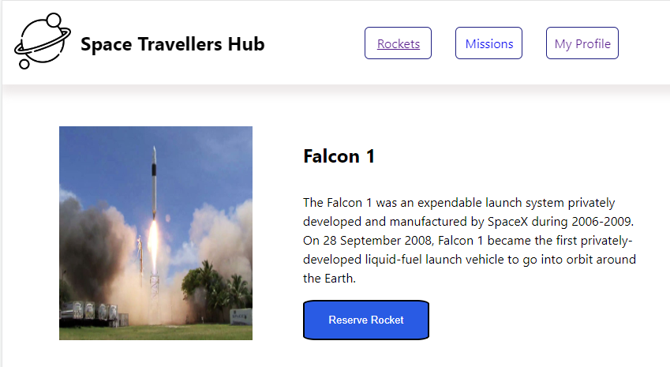
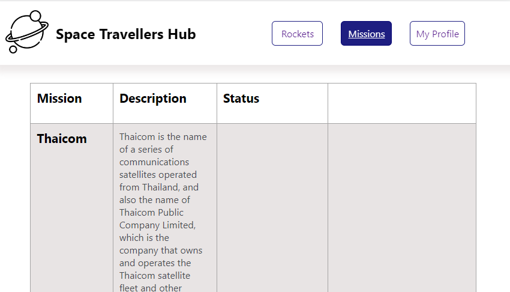
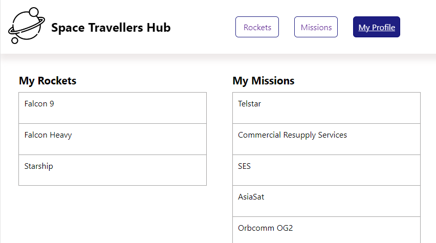

# SpaceX

> In this project, we have worked with the real live data from the SpaceX API.We build a web application for a company that provides commercial and scientific space travel services. The application will allow users to book rockets and join selected space missions.

## Screen shots

- 
- 
- 

## Built With

- 
- 
-  
- 
- 
-    
- 
- 
- 
- 

## Live Demo (if available)

[Live Demo Link](https://spacex-api-microverse.herokuapp.com)


## Authors

👤 **Ritobroto Mukherjee**

- Portfolio: [@Rito](https://ritobrotomukherjee.github.io/Work-Portfolio/)
- GitHub: [@RitobrotoMukherjee](https://github.com/RitobrotoMukherjee)
- Twitter: [@RitobrotoM3](https://twitter.com/RitobrotoM3)
- LinkedIn: [Ritobroto Mukherjee](https://www.linkedin.com/in/ritobroto-mukherjee-519148ba/)


👤 **Terbeche Mostefa**

- GitHub: [@githubhandle](https://github.com/Terbeche)
- LinkedIn: [LinkedIn](https://www.linkedin.com/in/mustapha-terbeche/)

## Setup

To get this project up and running, you should do the following;
If you wish to run the project locally, please do the following:

1.- Clone the repository to your local machine.
    - **`git clone https://github.com/RitobrotoMukherjee/spacex.git`**
    - **`cd spacex`**

2.- Install Node.js and npm if you haven't already.
   To install Node.js, follow the instructions on [Node.js](https://nodejs.org/en/).
   
   To install npm with the necessary dependencies, run the following command in your terminal:
   ``` bash
   npm install 
   ```

3.- Once you have the setup and the project locally, you can run the project using the following command in your terminal:
``` bash
npm run build
```
4.- and if you want to watch the changes live, run the following command (it will run the website on localhost:3000):
``` bash
npm start
```


## 🤝 Contributing

Contributions, issues, and feature requests are welcome!

Feel free to check the [issues page](https://github.com/RitobrotoMukherjee/spacex/issues).

## Show your support

Give a ⭐️ if you like this project!

## Acknowledgments

- This project was based on the **SpaceX API** 
- Microverse

## 📝 License

This project is [MIT](./MIT.md) licensed.
